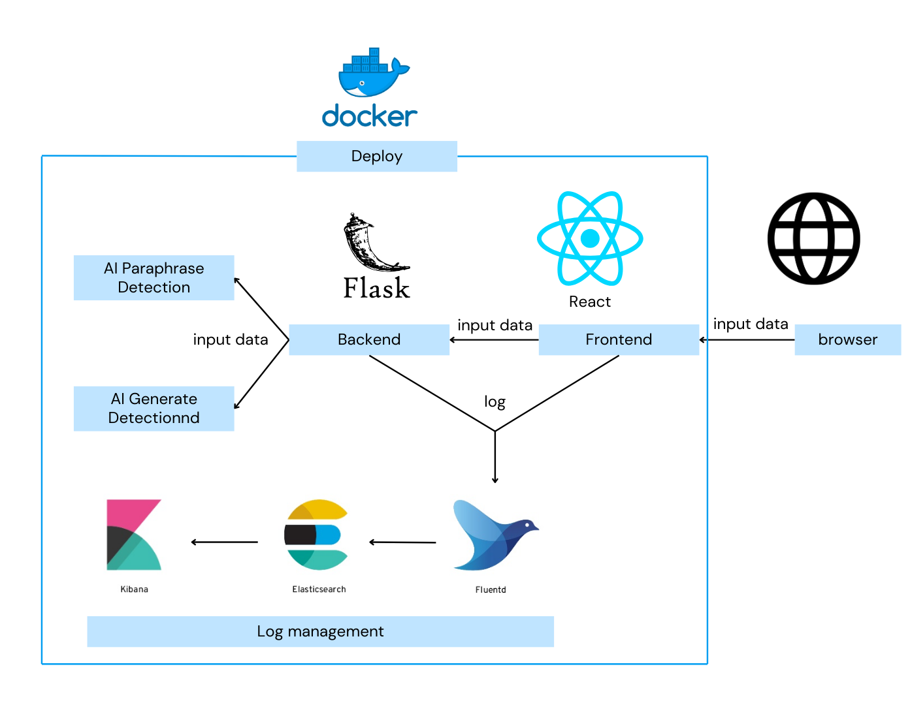
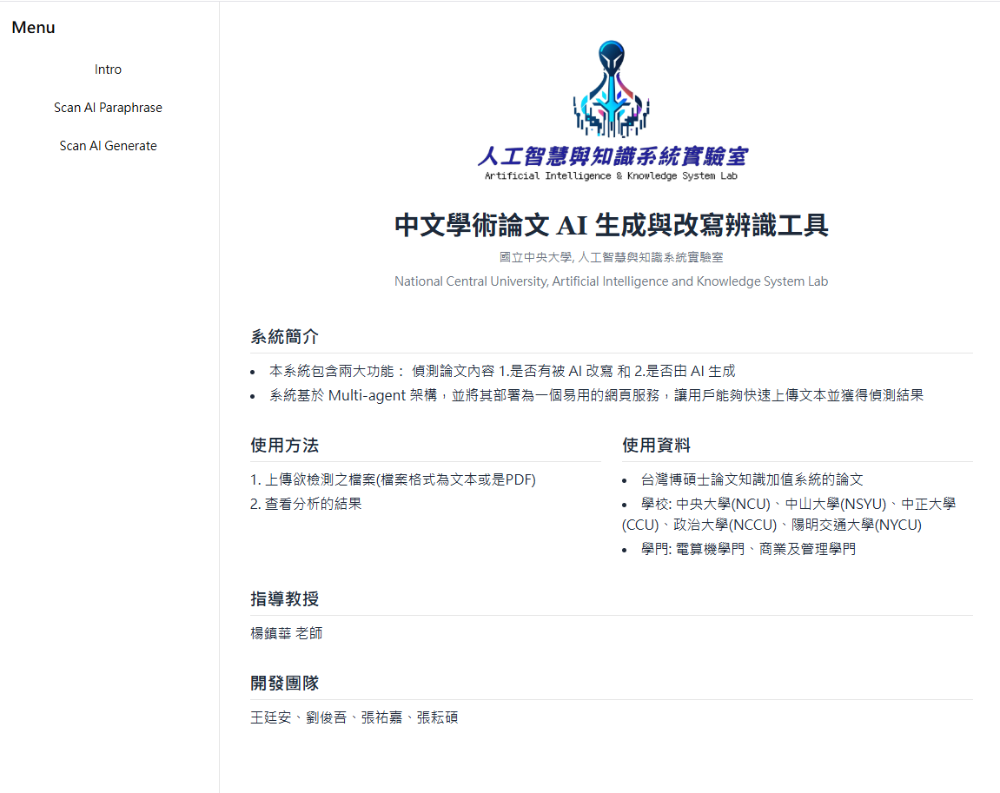
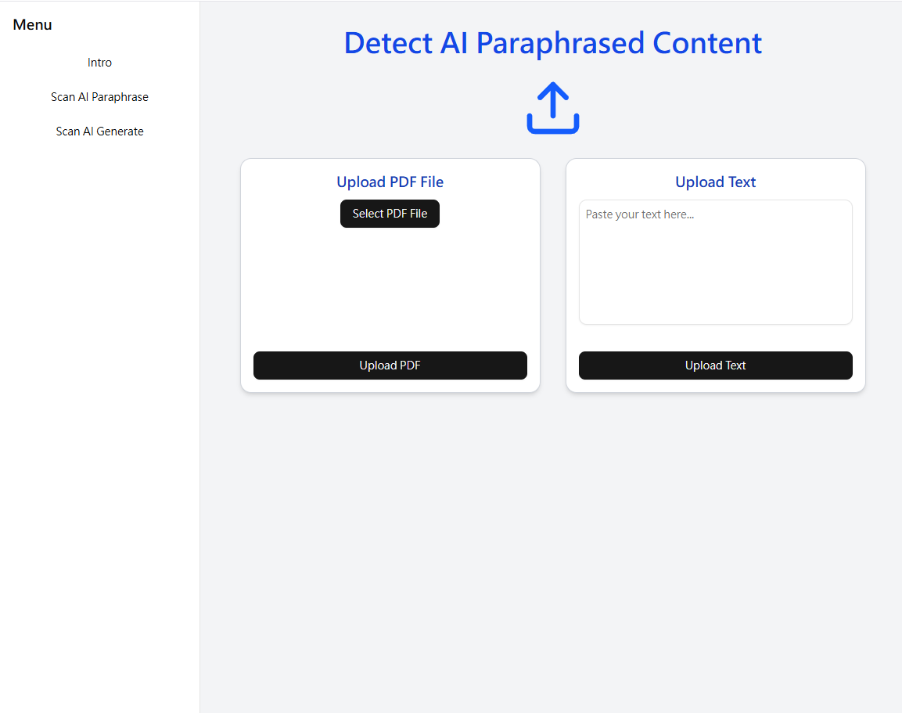
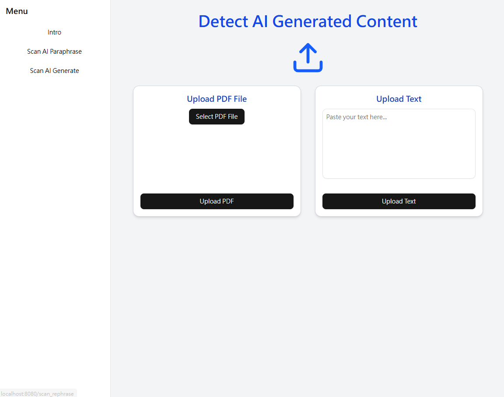
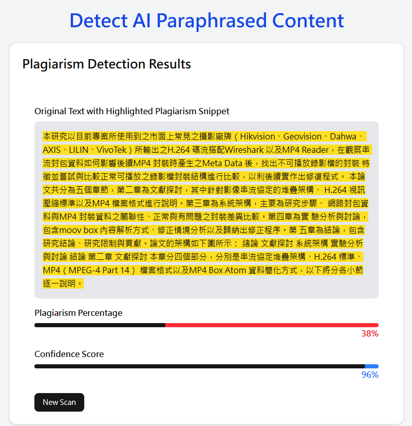
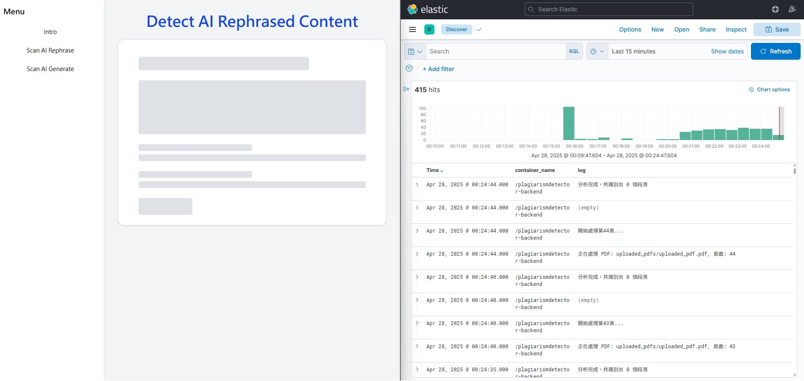

# 中文學術論文 AI 生成與改寫辨識工具

> 基於 Agentic RAG 架構的中文 AI 偵測系統  
> 📚 適用於學術論文、研究報告等高階語言內容  
> 🧠 前端使用 React，後端採用 Flask，支援 Docker 與 EFK 部署

---


---

## 🧠 系統簡介

本系統解決目前中文學術論文缺乏有效 AI 偵測工具的問題，具備以下核心功能：

- 🔍 偵測是否為 **AI 改寫文本**
- 🧠 偵測是否為 **AI 生成文本**

本系統採用多代理架構，結合文風分析、統計特徵與 RAG 知識庫，實現高準確度的判斷流程。

- [專題介紹影片youtube連結](<https://www.youtube.com/watch?v=HBbI5PD2HzI>)

---

## ⚙️ 系統架構

### 系統架構圖



### 🧠 AI 生成偵測流程

- `Style Agent`：分析語氣與句型風格
- `Heuristic Agent`：計算困惑度、重複率、句長變異
- `RAG Agent`：語意向量檢索輔以知識圖譜
- `Decision Agent`：統整分析回應並提供判斷結果

### 🔍 AI 改寫偵測流程

- `Retriever`：語意模型 multilingual-e5 檢索相似段落
- `Reranker`：bge-reranker 精選相關文獻
- `Main Agent`：進行初步抄襲分析
- `Reviewer Agent`：審查分析回應
- `Final Decision Agent`：整合意見做出最終判斷

### 🧾 Log 管理與監控（EFK）

本系統整合 **EFK 架構（Elasticsearch, Fluentd, Kibana）** 即時收集與監控後端與模型 log 資訊：

| Log 類型     | 範例                          |
|--------------|-------------------------------|
| 使用者請求   | `/api/text/generate`          |
| 模型狀態     | `RAG Agent finished inference`|
| 系統錯誤     | `PermissionError`, `Timeout` |
| PDF 處理紀錄 | `PDF saved to /uploads/...`   |

> 🔍 Log 會被收集並集中管理於 Kibana 介面中，便於視覺化追蹤。

---

## 頁面展示

### 首頁



### AI 改寫偵測檔案上傳



### AI 生成偵測檔案上傳



### 偵測結果

>螢光筆為具有抄襲嫌疑的文本片段



### EFK



## 📊 模型測試結果

| 測試項目   | 測試資料來源             | 測試筆數 | 原文準確度 | 改寫/生成準確度 |
|------------|--------------------------|----------|-------------|------------------|
| AI 改寫偵測 | 中央大學原文與改寫版本     | 1012     | 85%         | 95%              |
| AI 生成偵測 | 中央大學 & 中山大學生成文本 | 736      | 66.7%       | 66.7%            |

---

## 📁 資料來源

- **來源**：台灣碩博士論文知識加值系統
- **學校**：中央、中山、中正、政大、陽明交大等
- **數量**：
  - 人類原文：3988 筆
  - AI 改寫：3988 筆
  - AI 生成：2576 筆

---

## 🚀 安裝與執行說明

### 🔬 測試模式（非 Docker）

1. 建立前後端 `.env` 設定檔（參考 `.env.example`）
2. 後端（Flask）：

```bash
# environment.yml 是在 Ubuntu 24.04.2 LTS 建立的
conda env create -n env1 -f backend/environment.yml
conda activate env1
python flask_api.py
```

3. 前端（React）：

```bash
cd frontend/react_ui
npm install
npm run dev
```

---

### 🐳 使用 Docker

1. 在根目錄建立 `.env`（參考 `.env.example`）
2. 前端打包成靜態檔案：

```bash
cd frontend/react_ui
npm install
npm run build
```

3. 執行 Docker：

```bash
docker-compose up --build -d
```

---

## 👨‍🏫 指導教授

- 楊鎮華 教授（國立中央大學）

## 👨‍💻 開發團隊

- 張祐嘉
- 劉俊吾
- 張耘碩
- 王廷安

---

## 📄 License

本專案採用 MIT 授權條款，詳見 [LICENSE](./LICENSE)。

---

## 🙌 貢獻者

[Contributors](https://github.com/liu-chun-wu/PlagiarismDetector/graphs/contributors)  
  
Made with [contrib.rocks](https://contrib.rocks)
